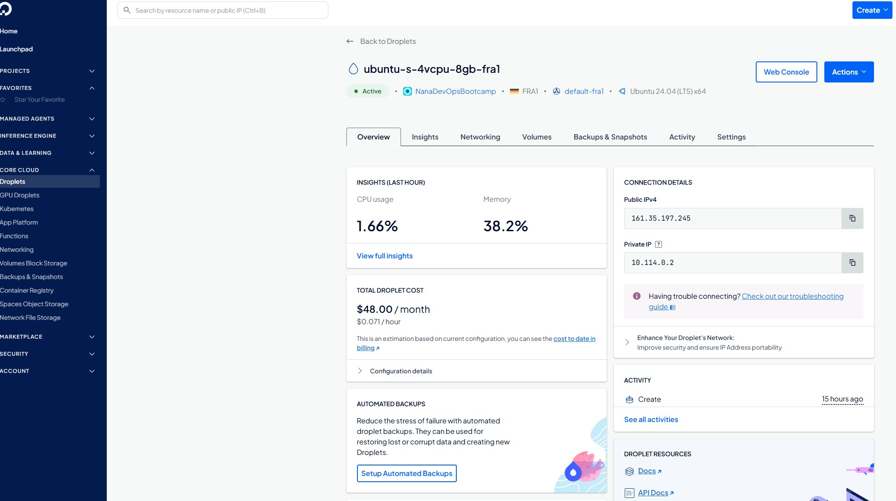
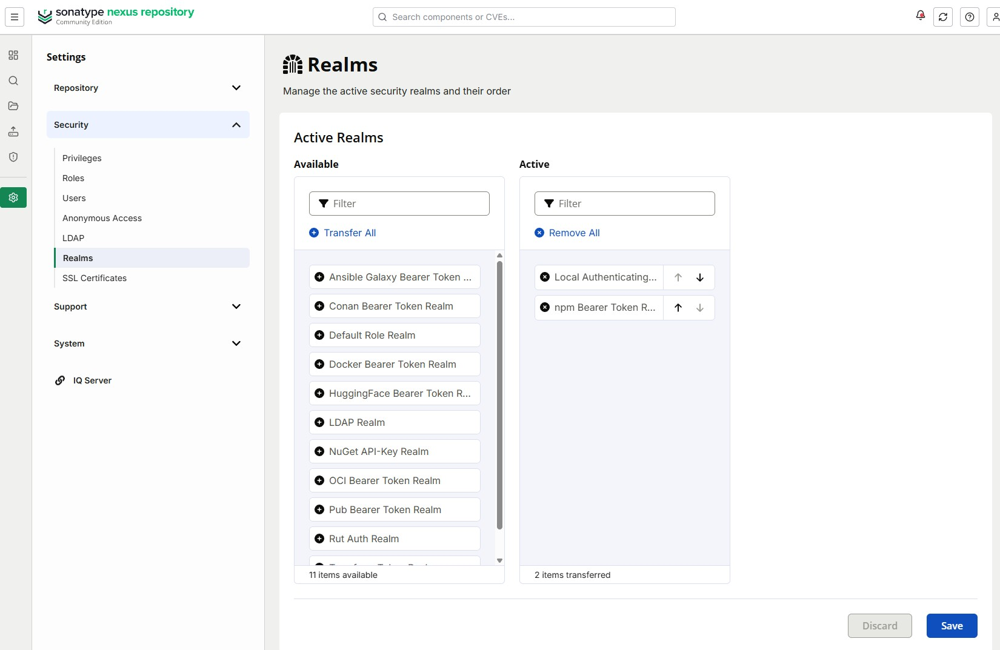
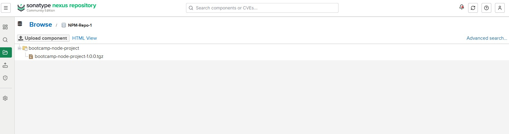

# Solutions for Exercises-06-Artifact-Repository-Manager

## Exercise 1

**My new Doplet on DigitalOcean:**



**This is how I installed Nexus on my Droplet:**

```bash
# Login with SSH.
ssh -i ~/.ssh/id_ed25519 root@161.35.197.245

# Install Java.
apt update
apt install openjdk-25-jre-headless
java --version

# Download and unzip Nexus.
cd /opt
wget https://download.sonatype.com/nexus/3/nexus-3.96.3-01-linux-x86_64.tar.gz
tar -xzvf nexus-3.96.3-01-linux-x86_64.tar.gz

# Create a new user and make it the new owner of Nexus.
adduser nexus

chown -R nexus:nexus nexus nexus-3.96.3-01
chown -R nexus:nexus nexus sonatype-work
ls -l

vim nexus-3.96.3-01/bin/nexus.rc
# Add a new line to it: run_as_user="nexus"

# Switch user and start Nexus.
su - nexus
/opt/nexus-3.96.3-01/bin/nexus start

ps aux | grep nexus
```

## Exercise 4

**On Nexus/Security/Realms page I had to add "npm Bearer Token Realm" to the Active Realms.**



**Steps of this exercise:**

```bash
# Navigate to the right folder.
cd Repositories/TWN-DevOps-Bootcamp-Exercises-05-Cloud-IaaS-Basics/app

npm pack

# And I had to use --auth-type option for login and enter my credentials.
npm login --auth-type=legacy --registry=http://161.35.197.245:8081/repository/NPM-Repo-1/

npm publish --registry=http://161.35.197.245:8081/repository/NPM-Repo-1/ ./bootcamp-node-project-1.0.0.tgz
```

**The result of the successful artifact upload.**


