# Solutions for Exercises-06-Artifact-Repository-Manager

## Exercise 1

**My new Doplet on DigitalOcean:**


**This is how I installed Nexus on my Droplet:**

```bash
# Login with SSH.
ssh -i ~/.ssh/id_ed25519 root@161.35.197.245

# Install Java.
apt update
apt install openjdk-25-jre-headless
java --version

# Download and unzip Nexus.
cd /opt
wget https://download.sonatype.com/nexus/3/nexus-3.96.3-01-linux-x86_64.tar.gz
tar -xzvf nexus-3.96.3-01-linux-x86_64.tar.gz

# Create a new user and make it the new owner of Nexus.
adduser nexus

chown -R nexus:nexus nexus nexus-3.96.3-01
chown -R nexus:nexus nexus sonatype-work
ls -l

vim nexus-3.96.3-01/bin/nexus.rc
# Add a new line to it: run_as_user="nexus"

# Switch user and start Nexus.
su - nexus
/opt/nexus-3.96.3-01/bin/nexus start

ps aux | grep nexus
```

## Exercise 2

**My new Blob Store:**

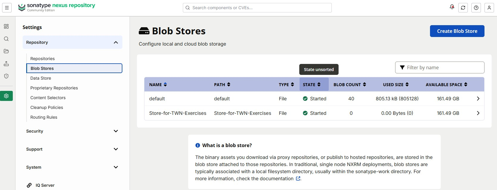

**My new hosted NPM repository:**

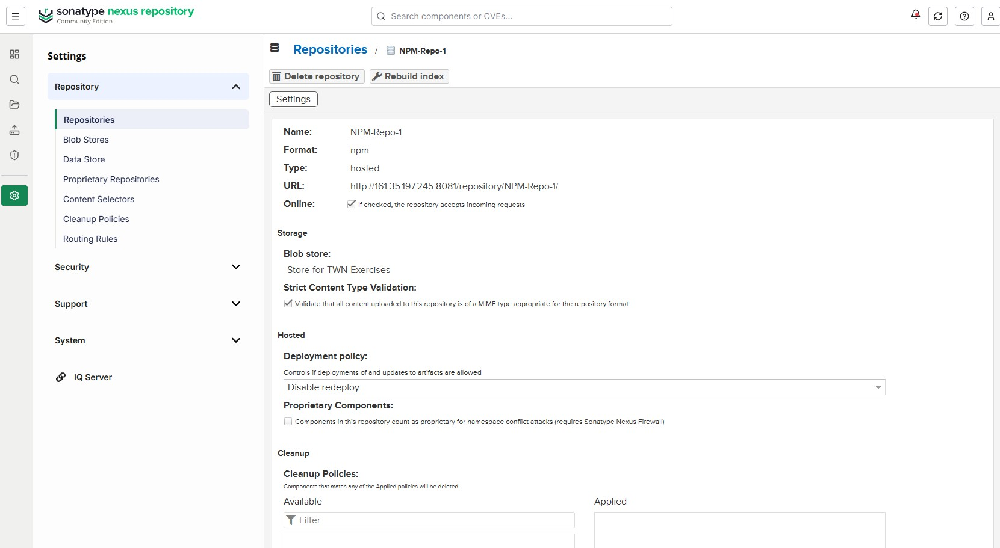

## Exercise 3

**The new NPM Role:**

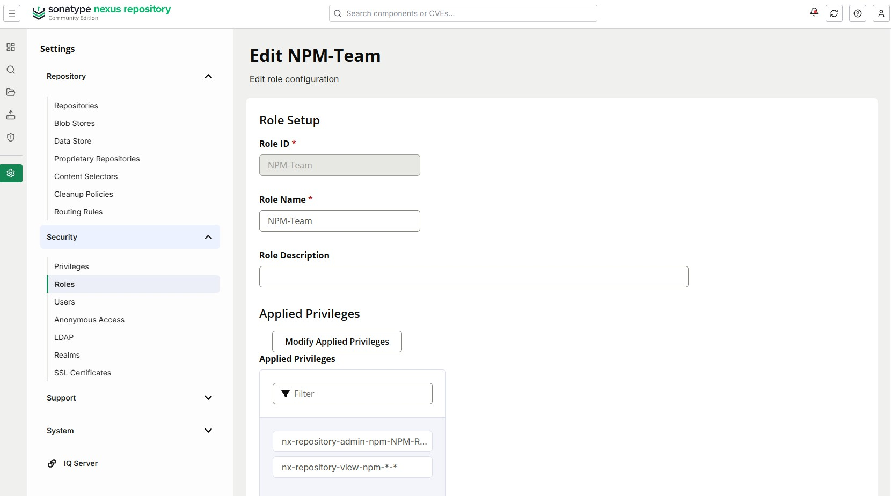

**The new NPM User:**

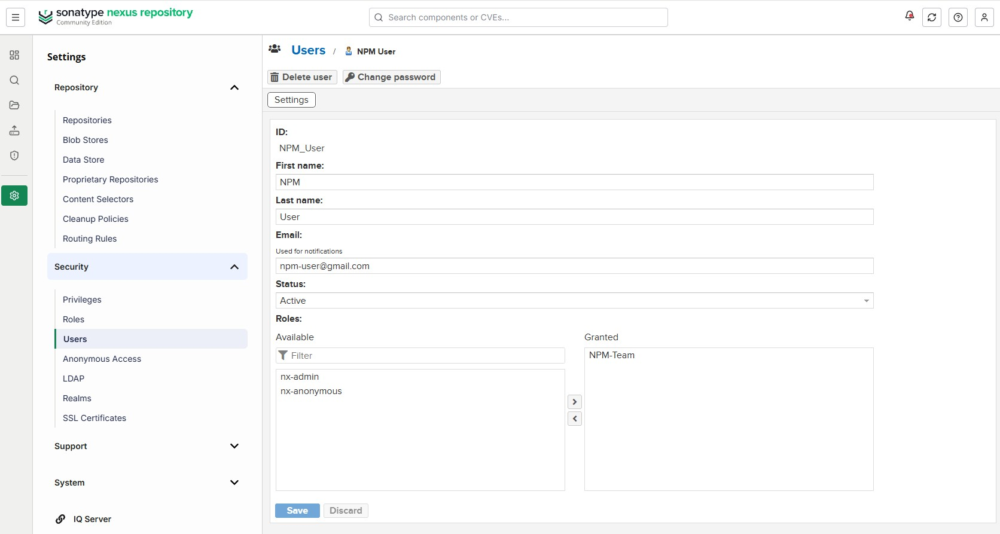

## Exercise 4

**On Nexus/Security/Realms page I had to add "npm Bearer Token Realm" to the Active Realms.**


**Steps of this exercise:**

```bash
# Navigate to the right folder.
cd Repositories/TWN-DevOps-Bootcamp-Exercises-05-Cloud-IaaS-Basics/app

npm pack

# And I had to use --auth-type option for login and enter my credentials.
npm login --auth-type=legacy --registry=http://161.35.197.245:8081/repository/NPM-Repo-1/

npm publish --registry=http://161.35.197.245:8081/repository/NPM-Repo-1/ ./bootcamp-node-project-1.0.0.tgz
```

**The result of the successful artifact upload.**


## Exercise 5

**The new hosted Maven repository:**

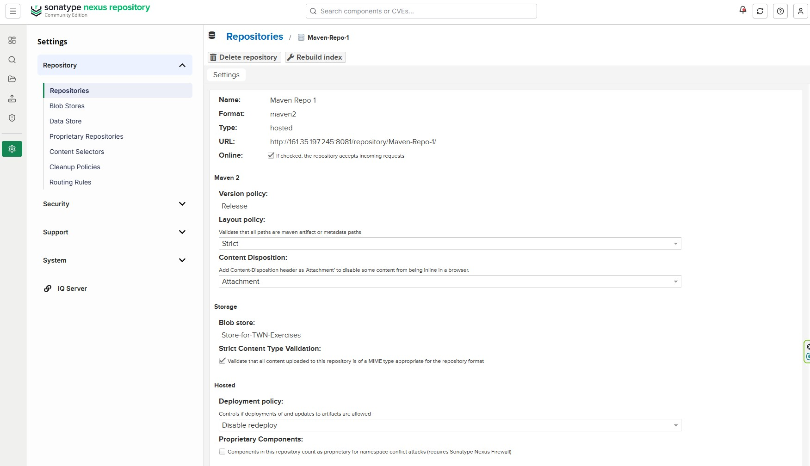

## Exercise 6

**The new Maven Role:**

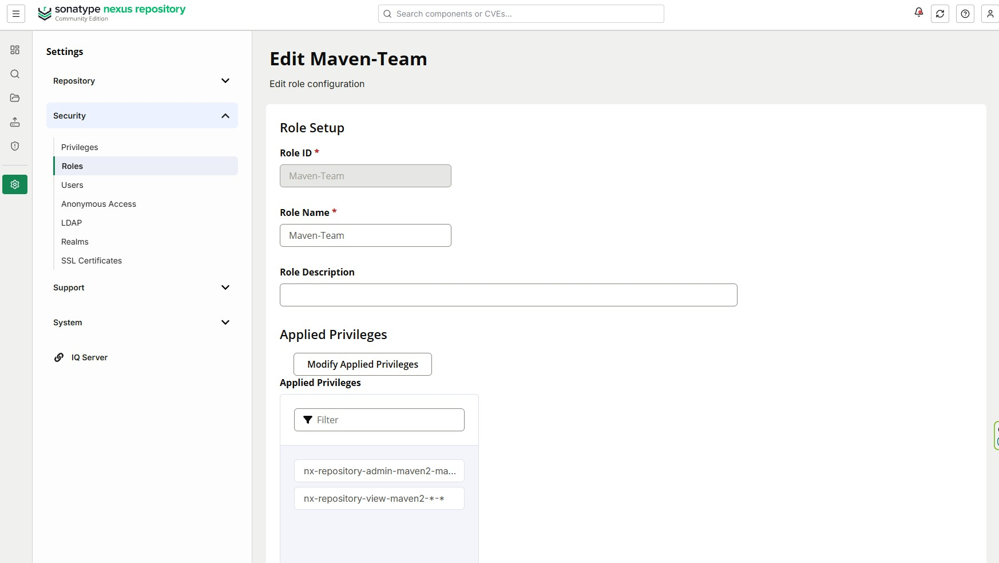

**The new Maven User:**

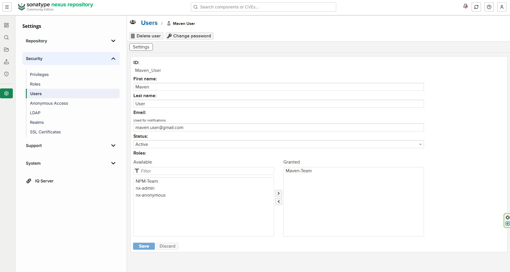

## Exercise 7

**I modified build.gradle to configure the app to use my Nexus server:**

```java
plugins {
    id 'java'
    id 'org.springframework.boot' version '3.5.5'
    id 'io.spring.dependency-management' version '1.1.0'
}

group 'com.example'
version '1.0.0'

java {
    toolchain {
        languageVersion = JavaLanguageVersion.of(17)
    }
}

apply plugin: 'maven-publish'

publishing {
    publications {
        create("maven",MavenPublication) {
            artifact("build/libs/my-app-$version"+".jar") {
              extension 'jar'
            }
        }
    }

    repositories {
        maven {
            name = 'nexus'
            url = "http://161.35.197.245:8081/repository/Maven-Repo-1/"
            allowInsecureProtocol = true
            credentials {
                username project.repoUserName
                password project.repoPassword
            }
        }
    }
}

repositories {
    mavenCentral()
    maven { url 'https://repo.spring.io/milestone' }
    maven { url 'https://repo.spring.io/snapshot' }
}

dependencies {
    implementation 'org.springframework.boot:spring-boot-starter-web'
    implementation 'net.logstash.logback:logstash-logback-encoder:9.0'
    implementation 'javax.annotation:javax.annotation-api:1.3.2'

    testImplementation 'junit:junit:4.13.2'
}
```

**I added gradle.properties for storing my Nexus credentials:**

```java
repoUserName = supersecretusername
repoPassword = supersecretpassword
```

**I also modified settings.gradle's last line to alter the projectname:**

```java
rootProject.name = 'my-app'
```

**At the end I built and published my artifacts:**

```bash
./gradlew clean build
./gradlew publish
```

**The result of the successful upload into the Maven artifact repository:**

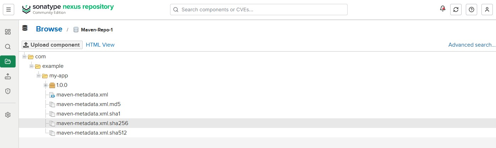

## Exercise 8

**I created a new user who has access to both repositories:**

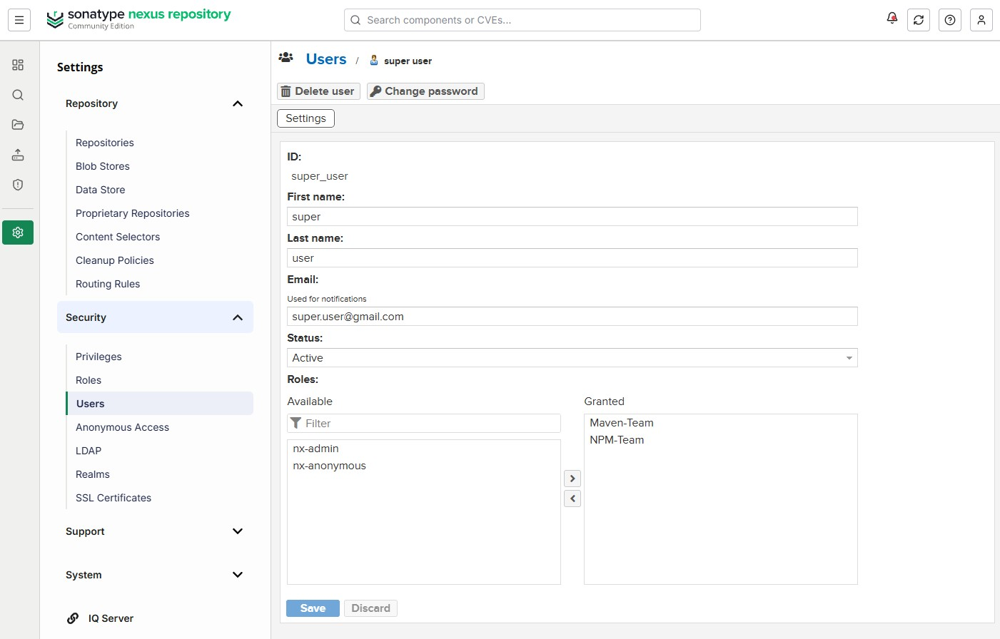

**After that, I logged in to my Jenkins server and fetch the Nexus API:**

```bash
ssh -i ~/.ssh/digital_ocean_key root@167.172.184.106

curl -u super_user:q1w2e3r4 -X GET 'http://161.35.197.245:8081/service/rest/v1/components?repository=NPM-Repo-1'
```

**Fetching the Nexus API:**

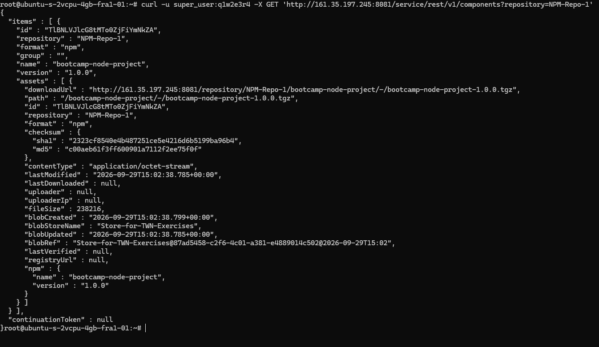

**After that, I executed some steps to download and run the app:**

```bash
cd /opt

wget http://161.35.197.245:8081/repository/NPM-Repo-1/bootcamp-node-project/-/bootcamp-node-project-1.0.0.tgz
mkdir my-node-app
tar -xzvf bootcamp-node-project-1.0.0.tgz -C ./my-node-app

apt install npm

cd ./my-node-app/package/
npm install
node server.js &

ps aux | grep node
```

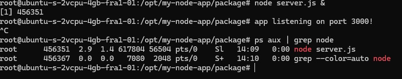

## Exercise 9

**At first I created a script to automatize fetching, downloading and running the latest version of that nodejs app.**
**Contents of Nexus-API-Script.sh:**

```bash
#!/bin/bash

# Extract the download URL.
curl -u USER_NAME:PASSWORD -X GET 'http://NEXUS_ADDRESS:8081/service/rest/v1/components?repository=NPM-Repo-1' | jq -r '.items[0].assets[0].downloadUrl' > artifacturl.txt
artifactUrl = $(cat artifacturl.txt)

echo "Downloading artifact from: $artifactUrl"

# Download and unzip the artifact.
wget "$artifactUrl" -O myapp.tgz
tar -xzvf myapp.tgz

# Install dependencies and run.
cd package
npm install
node server.js
```

**I used these commands to copy my script to my Droplet, SSH in and give it execute right:**

```bash
scp -i ~/.ssh/digital_ocean_key Nexus-API-Script.sh root@DROPLET_ADDRESS:/opt

ssh -i ~/.ssh/digital_ocean_key root@DROPLET_ADDRESS

chmod +x Nexus-API-Script.sh

./Nexus-API-Script.sh
```

**The result of running the script on my Droplet:**

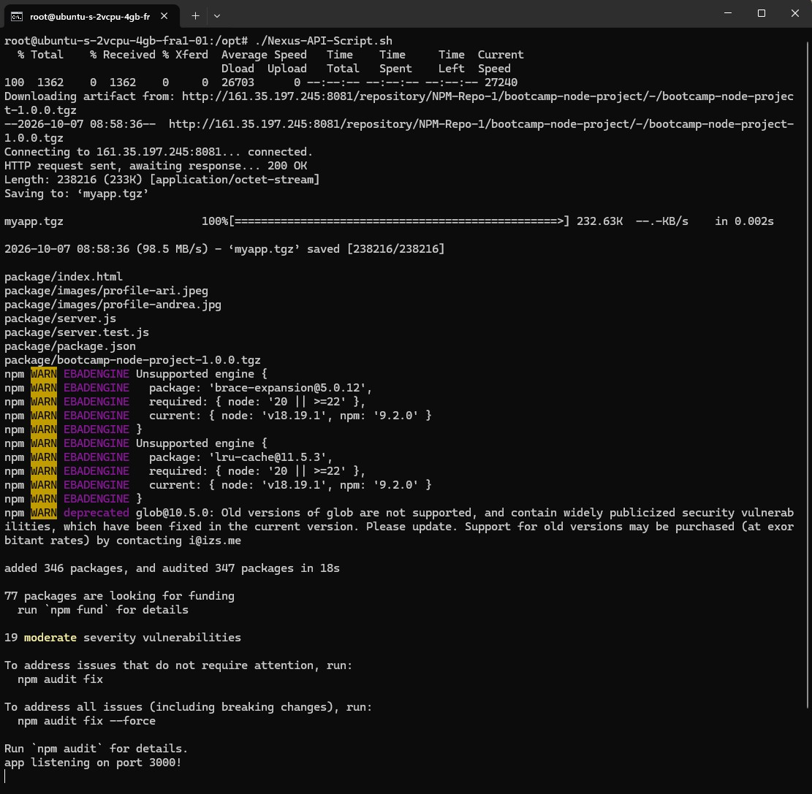
